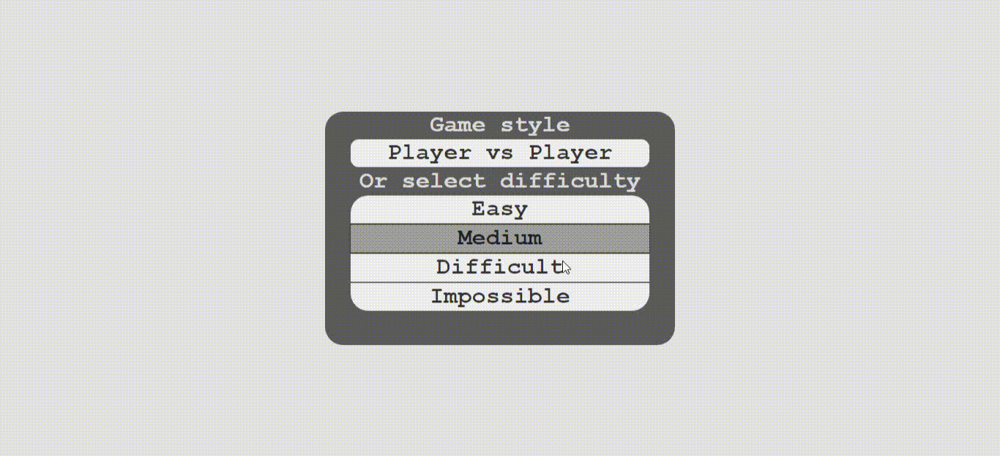

  <h1>✏️⚪✖️ Tic-Tac-Toe Game in Javascript✖️⚪✏️</h1>
  <h6>by <i>FranciscoCharles</i></h6>

This is just a simple example of the Tic Tac Toe game made only with **HTML**, basic **CSS** and pure **Javascript** (Vanilla JS).
As a challenge this game has an implementation of the minimax algorithm to select the best move.

    
     
    <h6>
        Figure 1 - gameplay example
    </h6>  

# <a name=index>Table of contents 📚</a>

- [**About the project**](#about_project)
- [**How can i run?**](#run)
- [**Version**](#version)
- [**License**](#license)

# **<a name=about_project>About the project? 🧠💭</a>** <h6>[back to indice](#index)</h6>

This project represents a simple tic tic that contains an implementation of the minimax algorithm to choose the best move for the computer. The language used is javascript. The game has two modes, being the first **player vs player** and the second **player vs computer**. Choosing the second option, you can select 4 difficulties, they are:

* Easy
* medium
* Difficult
* impossible

Test the game and have fun.

    
     
    <h6>
        Figure 2 - game home screen
    </h6>  

# **<a name=run>How can I run? 🧠💭</a>** <h6>[back to indice](#index)</h6>

 Download the project, go to the `src` folder and open the `index.html` file in a browser like Firefox or Chrome.

# **<a name=version>Version</a>**  <h6>[back to indice](#index)</h6>
- current version of the project: 1.0.1.

# **<a name=license>License</a>**  <h6>[back to indice](#index)</h6>

For more information on the license for this project read the <a href="./LICENSE" title="go to license file">LICENSE</a> file.

---

    Copyright © 2021 <b>FranciscoCharles</b>

