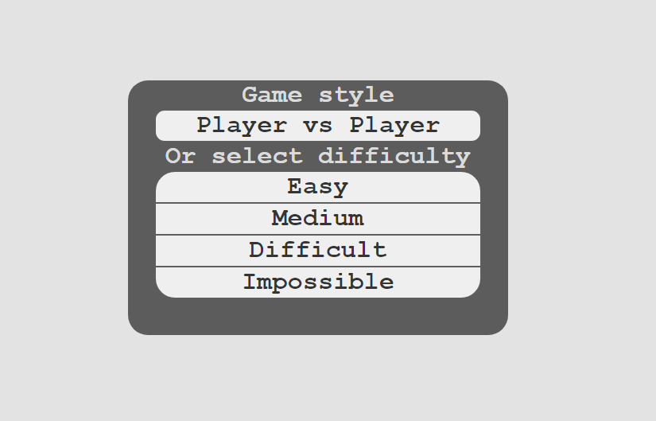

  <h1>✏️⚪✖️ Tic-Tac-Toe Game in Javascript✖️⚪✏️</h1>
  <h6>by <i>FranciscoCharles</i></h6>

This is just a simple example of the Tic Tac Toe game made only with **HTML**, basic **CSS** and pure **Javascript** (Vanilla JS).

    
     
    <h6>
        Figure 1 - example screen of game
    </h6>  

# <a name=index>Table of contents 📚</a>

- [**How can i run?**](#run)
- [**Version**](#version)
- [**License**](#license)

# **<a name=run>How can I run? 🧠💭</a>** <h6>[back to indice](#index)</h6>

 Download the project, go to the `src` folder and open the `index.html` file in a browser like Firefox or Chrome.

# **<a name=version>Version</a>**  <h6>[back to indice](#index)</h6>
- current version of the project: 0.2.1.

# **<a name=license>License</a>**  <h6>[back to indice](#index)</h6>

For more information on the license for this project read the <a href="./LICENSE" title="go to license file">LICENSE</a> file.

---

    Copyright © 2021 <b>FranciscoCharles</b>

